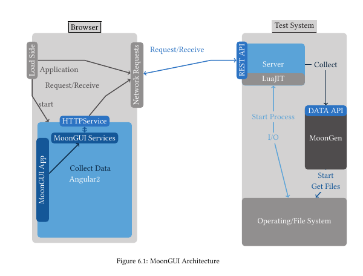
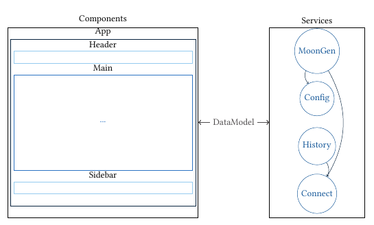
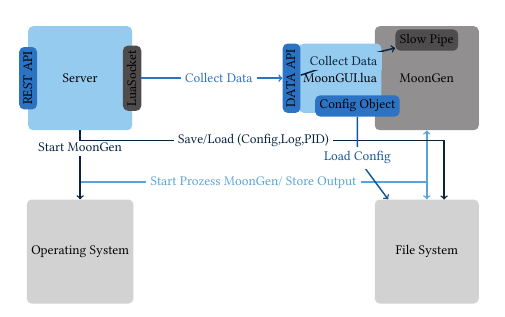

# MoonGUI Architecture
MoonGUI's architecture is based on basically three parts, the MoonGen process, the Server and the client. In the following picture you can see a first overview of the complete Architecture
 
 
## Client Architecture
 The Client part is a Angular2 based frontend, described in the following picture:
  
  
## Server Architecture  
The Server is based on the Server which starts and stops the MoonGen process and collects data like described in the following pciture:
  
